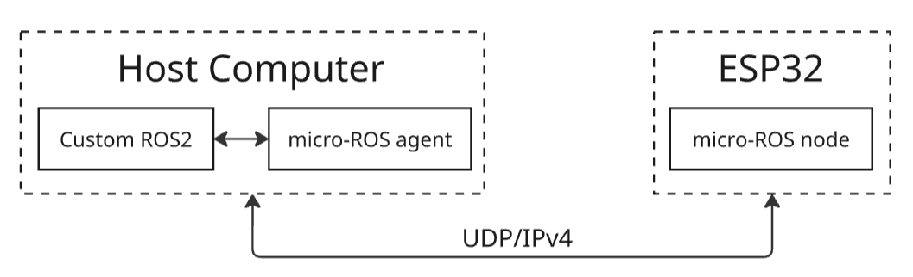

# Electronic Upgrade for FIRA Robot

<p align="center">
  
</p>


---

## Table of Contents

1. [Introduction](#introduction)
2. [Repository Contents](#repository-contents)
3. [Hardware Components](#hardware-components)
4. [System Integration](#system-integration)
5. [Improvements](#improvements)
6. [Future Work](#future-work)
7. [Setup](#setup)
8. [micro-ROS Architecture](#micro-ros-architecture)
9. [Technologies Used](#technologies-used)
10. [Support Video](#support-video)
11. [Copyright Notice](#copyright-notice)

---

## Introduction

This repository documents the electronic update of the legacy YSR-A (5vs5 Ver128) robot, originally designed for the FIRA competition. The updated version modernizes the robot using embedded systems, real-time data transmission, and sensor integration under the ROS 2 ecosystem.

---

## Repository Contents

- **ESP32code.ino** – Main ESP32 firmware for motor control, sensors, and micro-ROS communication.
- **ESP32CAMcode.ino** – ESP32-CAM firmware for video streaming and Bluetooth reception.
- **microROSagent.png** – Diagram of micro-ROS communication architecture.
- **Electronic Update v1.0.jpg** – Image of the updated robot hardware (used as profile image).
- **Robot_FIRA_Project_v1_0.pdf** – Project documentation.
- **YSR_A(5vs5-Ver128)Usermanual.pdf** – Legacy platform user manual.
- **SDC-310_240_manu(E).pdf** – CCD camera manual.
- **README.md** – This file.

---

## Hardware Components

- ESP32 and ESP32-CAM
- 4x VL53L0X (with I2C multiplexer)
- INA219 (voltage/current sensor)
- MPU6050 (IMU)
- TB6612FNG motor driver
- Two Faulhaber MOTOR 2224U006SR motors with encoders
- LED indicators and control push button
- 2S battery pack with custom regulator (5V output)
- Capacitors and inductors for power stabilization

---

## System Integration

- ESP32 handles sensors, motor control, and micro-ROS communication over UDP4.
- ESP32-CAM streams video (HTTP MJPEG) and receives Bluetooth commands via Dabble.
- All sensors are connected through a power-stabilized perfboard with pin headers for future expansion.
- micro-ROS agent is run on a ROS 2 host via Wi-Fi.

---

## Improvements

- ESP32 + ESP32-CAM (Wi-Fi + Bluetooth)
- ESP32-CAM (OV2640) camera
- TB6612FNG dual H-bridge motor drivers
- 2 × Faulhaber 2224U006SR motors
- 7.4V Li-ion (2S AAA) battery
- Added MPU6050, VL53L0X, LiDAR, INA219
- Wi-Fi (ROS 2) + Bluetooth (Dabble App)
- 3 LEDs (Reset, BT, Wi-Fi) + buzzer
- Multiple I2C, UART, PWM ports available

---

## Future Work

- Integrate and test LD19 LiDAR with ROS 2.
- Conduct final performance evaluation in real scenarios.
- Design and manufacture custom PCB.
- Develop advanced software (SLAM and autonomous navigation).
- Publish documentation and open-source all resources.

---

## Setup

### Clone the ROS 2 workspace

You can download and clone the `ros2_ws` workspace from the following link:

📁 [ros2_ws - OneDrive](https://1drv.ms/u/c/bbff4df3d4a71f59/EQFS6SLN8G1LjDHccNO1hlYBL5kKMeeIzTfUJ0hXwQ3mNA?e=QNpNlW)

### Library Installation

Install the following Arduino libraries:

- Adafruit MPU6050
- ESP32Servo
- VL53L0X (by Pololu)
- Adafruit INA219
- DabbleESP32

### ESP32-CAM Configuration

In the Arduino IDE, select the board:

```cpp
#define CAMERA_MODEL_AI_THINKER
```

Then select: **AI THINKER ESP32 CAM**

---

## micro-ROS Architecture

<p align="center">
  
</p>

---

## micro-ROS Installation Instructions (Ubuntu 22.04, ROS 2 Humble)

```bash
sudo snap install arduino
```

Install ESP32 boards:
- Preferences > Additional Board URLs:  
  `https://raw.githubusercontent.com/espressif/arduino-esp32/gh-pages/package_esp32_index.json`
- Board Manager > Install **esp32** v2.0.2

Then:
```bash
git clone https://github.com/micro-ROS/micro_ros_arduino.git -b humble
# Add the ZIP as library in Arduino IDE
```

Create the Agent:

```bash
cd ~/LF-Robotics/Robot_FIRA/ros2_ws/src/
git clone https://github.com/micro-ROS/micro-ROS-Agent.git -b humble
cd ..
rosdep install --from-paths src --ignore-src -r -y
colcon build --symlink-install
```

Fix common Python issues:
```bash
source $HOME/.espressif/python_env/idf4.4_py3.10_env/bin/activate
pip install --upgrade catkin_pkg
deactivate
```

Add this to your `~/.bashrc`:
```bash
source ~/LF-Robotics/Robot_FIRA/ros2_ws/install/setup.bash
```

Start the micro-ROS Agent:

```bash
ip a  # or hostname -I
ros2 run micro_ros_agent micro_ros_agent udp4 --port 8888
```

---

## Run the Robot

Once everything is set up:

```bash
# Terminal 1
ros2 launch robot_fira launch_node.launch.py

# Terminal 2
ros2 run robot_fira teleop.py
```

---

## Technologies Used

<p align="center">
   
  
  
</p>


---

## Support Video

📺 [Support video tutorial - OneDrive](https://1drv.ms/v/c/bbff4df3d4a71f59/EaiGXuramTVJjmTzD2OHNhMB1i05BiB5UKKjjw56KOtR_w?e=c3pjqZ)

---

## Copyright Notice

© 2025 Leffer Trochez. All rights reserved.  
Redistribution or modification without permission is not allowed.

Contact: l.trochez@uniandes.edu.co

